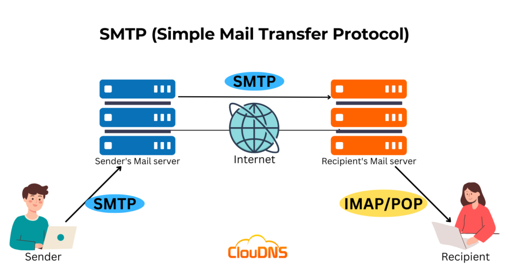
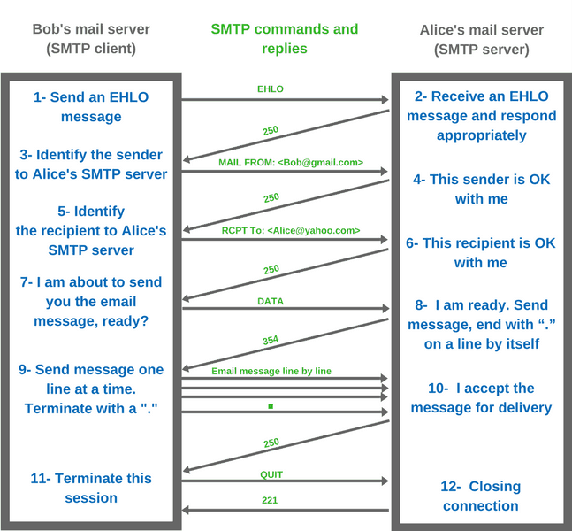

# sending mail using googl smtp server

# SMTP MAIL SERVER

## mail server

It is a dedicated computer or software system that handles the sending, receiving, and storage of email messages.

### SMTP, IMAP, POP3

- smtp=sending emails, port - 25, 465, 587

- imap=emails stays on server, retreiving and managing it on multiple devices

- pop3=downloading emails in local machine , limited server storage, single device use

## Cpanel

cPanel is a web hosting control panel that not only simplifies website management but also streamlines mail server administration. With cPanel, you can:

- Create and Manage Email Accounts: Easily set up new email addresses for your domain (e.g., user@example.com).

- Configure Mail Settings: Manage features like forwarders, auto-responders, and spam filters.

- Monitor Mail Usage: Check statistics on mail delivery and usage.

- Integrate DNS Management: Within cPanel, you can modify DNS records (like MX, SPF, DKIM) to ensure your email is routed correctly and is secure.

## DNS records

DNS (Domain Name System) records are critical for directing email traffic:-

- MX Records: These records tell the internet which server should receive email for your domain. For instance, an MX record might state that emails to example.com should be handled by mail.example.com.

- SPF Records (TXT Records): An SPF record specifies which mail servers are authorized to send email on behalf of your domain. This helps prevent spammers from sending emails that appear to originate from your domain.

- DKIM Records: DKIM (DomainKeys Identified Mail) adds a digital signature to your emails, which receiving servers can verify to ensure that the email content hasn't been altered in transit.

- DMARC Records: DMARC builds on SPF and DKIM to provide instructions on how to handle emails that fail authentication checks, enhancing your domain’s overall email security.

## example

1. When someone sends an email to user@example.com, the sending mail server looks up the MX record for example.com and learns to send the email to mail.example.com.

2. The mail server at mail.example.com receives the email and stores it in user@example.com’s mailbox.

3. The recipient then retrieves the email using their preferred email client via protocols like IMAP or POP3.

## connection example

